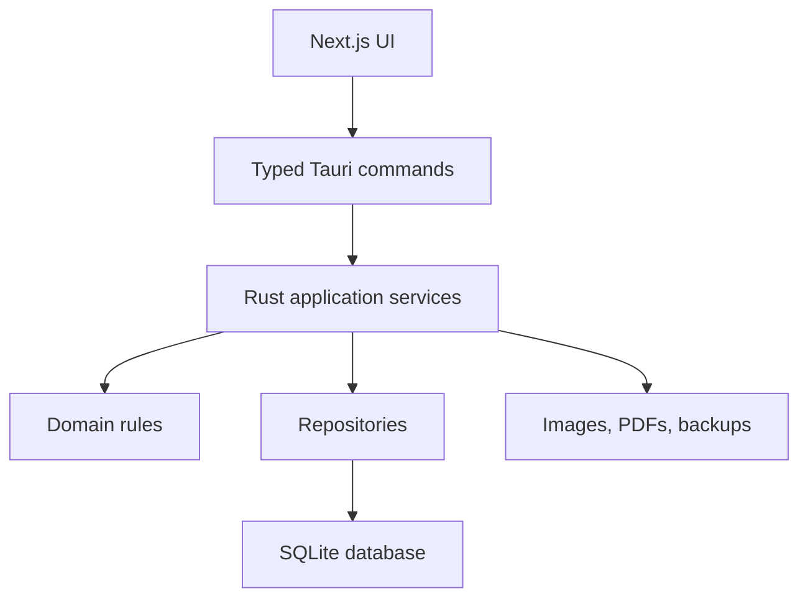

# System Architecture

## Architectural style

Use a layered, modular monolith inside a Tauri desktop application. The Next.js frontend renders the interface; Tauri commands form the trusted boundary; Rust services enforce use cases; repositories access SQLite. Business rules must not live only in React components.

## Layers

### Presentation layer

- Pages, dialogs, tables, forms, print previews, accessibility.
- Sends validated command DTOs and renders typed results.
- May calculate display previews but is never the authority for totals, stock, or permissions.

### IPC boundary

- Small typed Tauri commands grouped by bounded context.
- Deserializes and validates input.
- Resolves current authenticated session.
- Converts internal errors to stable public error codes.

### Application layer

- Coordinates workflows such as `complete_sale`, `receive_purchase`, and `restore_backup`.
- Opens one transaction per atomic use case.
- Calls policy, repository, document, and file services.

### Domain layer

- Money, quantity, document state, discount, due, stock, reservation, and reversal rules.
- Pure functions where possible and unit-tested independently.

### Infrastructure layer

- SQLite repositories and migrations.
- App-data file store for images and documents.
- PDF, CSV, logging, clock, identifier, backup, and licensing adapters.

## Module boundaries

`catalog`, `inventory`, `bundles`, `sales`, `customers`, `purchasing`, `suppliers`, `delivery`, `expenses`, `reporting`, `identity`, `audit`, `backup`, and `settings` are explicit modules. Cross-module changes go through application services, not direct frontend calls to tables.

## Trust boundaries

- Treat all frontend IPC input as untrusted.
- Validate paths against approved app directories.
- Authorize every sensitive command in Rust.
- Keep the SQLite connection and secrets inaccessible to JavaScript.
- Do not expose arbitrary SQL or unrestricted filesystem commands.

## Offline and future multi-device path

SQLite is excellent for a single local writer application. Do not place the database on a shared network drive. A future branch/multi-device edition should retain application-service contracts and replace local repositories with an authenticated API backed by PostgreSQL.

