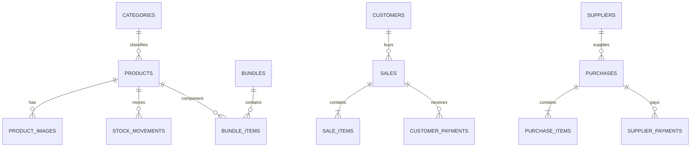

# Database Design

## Principles

- SQLite is authoritative for structured business data.
- Foreign keys and check constraints protect invariants.
- Financial and inventory history uses append-only entries and reversals.
- Documents store snapshots of names, article numbers, prices, and components so history does not change when master data changes.
- Every business table includes `id`, `created_at`, and appropriate `updated_at`, status, and archive fields.

## Main entity relationships

## Table groups

### Master data

`categories`, `product_types`, `products`, `product_images`, `product_attributes`, `locations`, `units`, `tax_profiles`, `payment_methods`, `expense_categories`.

### Bundles

`bundles`, `bundle_items`.

### Inventory

`stock_movements`, `stock_reservations`, optional cached `stock_balances` maintained transactionally.

### Sales

`customers`, `sales`, `sale_items`, `sale_item_components`, `customer_payments`, `customer_ledger_entries`, `sales_returns`, `sales_return_items`, `refunds`.

### Purchasing

`suppliers`, `purchases`, `purchase_items`, `goods_receipts`, `supplier_payments`, `supplier_ledger_entries`, `supplier_returns`, `supplier_return_items`.

### Operations

`deliveries`, `delivery_items`, `expenses`, `cash_accounts`, `cash_entries`.

### Administration

`users`, `roles`, `permissions`, `user_roles`, `role_permissions`, `sessions`, `audit_logs`, `settings`, `document_sequences`, `schema_migrations`, `backup_history`, `license_state`.

## Critical constraints

- `products.article_number` is unique case-insensitively among non-archived products.
- Quantities must be positive on line items; movement direction is represented explicitly.
- Money values use integers and valid sign constraints.
- A posted document cannot be edited as a draft; correction uses cancellation or reversal.
- Payment allocation cannot exceed the unallocated payment amount or document due.
- Bundle component quantities must be greater than zero and a bundle cannot contain itself.
- Stock cannot become negative unless an explicit setting and permission allow it.

## Indexes

Index article number, normalized product name, category/type, movement product/location/time, document number/date/status, customer/supplier name and phone, ledger party/time, delivery date/status, and all foreign keys used by reports.

## Views

Use tested SQL views for `current_stock`, `customer_balances`, `supplier_balances`, `sale_totals`, `purchase_totals`, and `daily_cash_summary`. Views simplify reporting but must not become the only enforcement mechanism.

